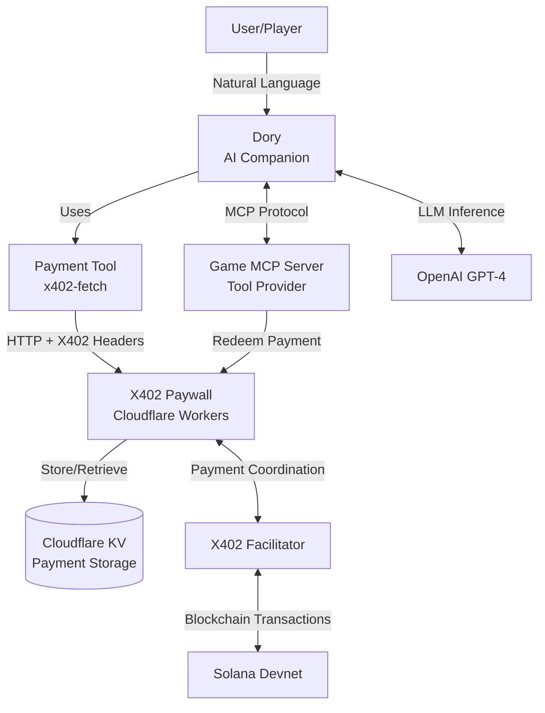
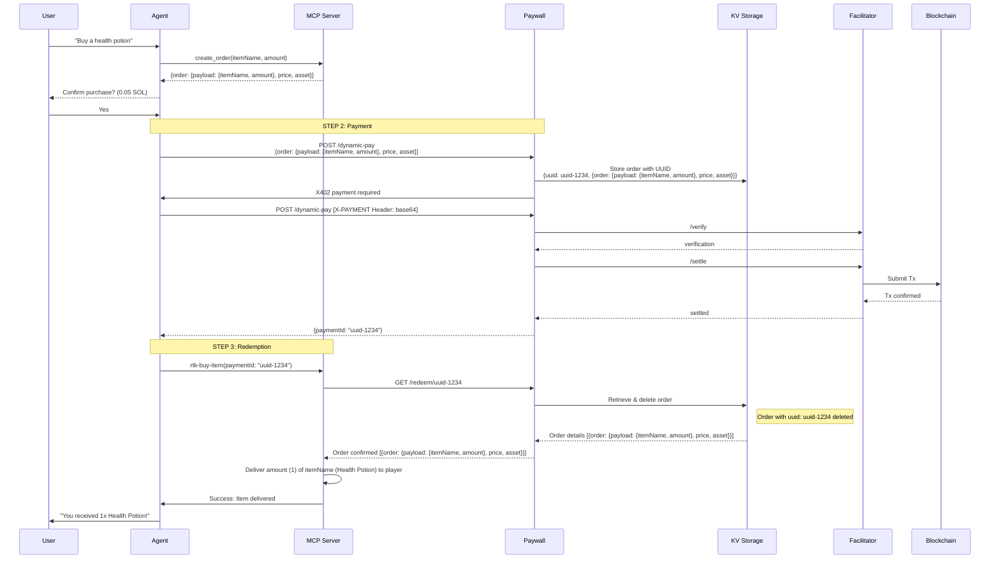

# Dory X402 - AI Gaming Companion with MCP & Micropayments

> **A revolutionary approach to game monetization**: Game developers can integrate cryptocurrency micropayments by simply creating an MCP server—no payment code required!

## Overview

This repository demonstrates how game developers can add blockchain-based micropayments to their games using the **Model Context Protocol (MCP)** without writing any payment infrastructure code. The system consists of three main components:

1. **AI Gaming Companion** ([agent/](agent/)) -Ai agent that interfaces with games via MCP and handles payments
2. **Game MCP Server** ([mcp/](mcp/)) - Reference implementation showing how games could expose functionality as MCP tools
3. **X402 Paywall** ([paywall/](paywall/)) - Payment gateway using the X402 protocol on Solana

## Architecture Diagram



### Purchase Flow Sequence



## Key Innovation

### For Game Developers

**You only need to implement TWO MCP tools to enable payments:**

1. **`create_order`** - Returns order details (item name, price)
2. **`rtk-buy-item`** - Delivers items after payment confirmation

That's it! The agent handles all payment complexity:
- Wallet management
- Transaction signing
- Payment protocol (X402)
- User confirmations

### What Dory x402 Provides

Dory x402 can provide both components as a service:
- **The AI Gaming Companion** - Works with any game that has an MCP server
- **The X402 Paywall** - Handles all payment infrastructure

**Result**: Game developers focus on game logic, not payment infrastructure.

## Quick Start

### Prerequisites

- Node.js 18+
- pnpm (or npm)
- OpenAI API key
- Solana devnet wallet with some SOL

### 1. Setup Paywall (First!)

```bash
cd paywall
pnpm install

# Configure wrangler.jsonc:
# Set TREASURY_ADDRESS to your Solana wallet address

# Test locally
pnpm run dev     # Runs on http://localhost:8789
```

### 2. Setup MCP Server

```bash
cd mcp
pnpm install

# Keep note of the absolute path to server.js
pwd  # Will need this for agent configuration
```
If you want to test the mcp server as standalone you can run `PAYWALL_URL=http://localhost:8789 pnpm start`

### 3. Setup Agent

```bash
cd agent
pnpm install

# Create .env file
cp .env.example .env

# Edit .env and set:
# - OPENAI_API_KEY=your_openai_key
# - AGENT_PRIVATE_KEY=your_solana_private_key_base58
# - PAYWALL_URL=https://your-paywall.workers.dev
# - GAME_MCP_SERVER_PATH=/absolute/path/to/mcp/server.js

# Start the agent
pnpm run dev     # Opens playground
```

### 4. Try It Out!

Open the playground at http://localhost:4111/agents/doryAgent and try:

```
User: "What's in my inventory?"
Agent: [Shows inventory via MCP]

User: "What can I buy?"
Agent: [Shows store items with prices]

User: "Buy me a health potion"
Agent: "This will cost 0.05 SOL. Confirm purchase?"

User: "Yes"
Agent: [Processes payment, redeems, delivers item]
      "You received 1x Health Potion! Balance updated."
```

## How It Works

### Component Responsibilities

| Component | Responsibility |
|-----------|----------------|
| **Game MCP Server** | Exposes game functionality as tools (`get_inventory`, `create_order`, `rtk-buy-item`) |
| **AI Agent** | Orchestrates gameplay, handles payment tool, provides natural language interface |
| **Payment Tool** | Uses x402-fetch to make payments with X402 protocol |
| **X402 Paywall** | Processes payments, stores orders, handles redemption |

### The 3-Step Purchase Process

1. **Create Order** (MCP Tool)
   - Game creates order with item details and price
   - Returns order object to agent

2. **Process Payment** (Agent Tool)
   - Agent confirms with user
   - Uses x402-fetch to make payment request
   - Paywall validates, stores order, returns payment ID

3. **Deliver Item** (MCP Tool)
   - Game redeems payment ID with paywall
   - Paywall confirms and deletes payment (one-time use)
   - Game delivers item to player

### Security Features

- **One-time payment IDs** - Each payment UUID can only be redeemed once
- **X402 protocol** - Standardized micropayment protocol with cryptographic verification
- **Payment separation** - Payment logic separated from game logic
- **Treasury wallet** - All payments go to configured treasury address
- **Blockchain verification** - Payments verified on Solana blockchain

## Environment Variables

### Agent ([agent/.env](agent/.env.example))

```bash
OPENAI_API_KEY=sk-...                                 # OpenAI API key for GPT-4
AGENT_PRIVATE_KEY=your_base58_private_key             # Solana wallet for payments
PAYWALL_URL=http://                                   # Your paywall URL
GAME_MCP_SERVER_PATH=/absolute/path/to/mcp/server.js  # Path to game MCP server
SOLANA_RPC_URL=https://api.devnet.solana.com          # Solana RPC URL
```

### Paywall ([paywall/wrangler.jsonc](paywall/wrangler.jsonc))

```json
{
  "vars": {
    "FACILITATOR_URL": "https://facilitator.payai.network",
    "NETWORK": "solana-devnet",
    "TREASURY_ADDRESS": "your_solana_wallet_address"
  },
  "kv_namespaces": [{
    "binding": "X402_PAYMENTS",
    "id": "your_kv_namespace_id"
  }]
}
```

## Example Game Store Items

The reference MCP server includes these purchasable items:

| Item | Price (USDC) | Description |
|------|-------------|-------------|
| Iron Sword | 0.1 | A sturdy iron blade |
| Health Potion | 0.05 | Restores 50 HP |
| Magic Shield | 0.2 | Protective magical barrier |
| Spell Scroll | 0.1 | Single-use spell scroll |


## Development

### Running

```bash
# Test paywall locally
cd paywall && pnpm run dev

# Test MCP server
cd mcp && pnpm start

# Test agent
cd agent && pnpm run dev
```

---

**Built with ❤️ by the Friends4Payments team**
