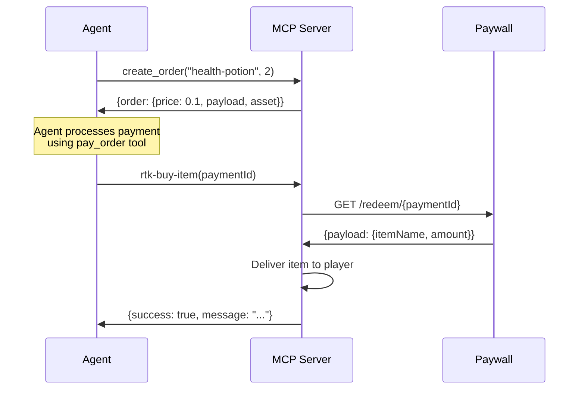

# Game MCP Server - Reference Implementation

A reference implementation of a game MCP (Model Context Protocol) server that demonstrates how game developers can expose game functionality as tools and integrate cryptocurrency micropayments.

## Overview

This MCP server serves as a **template for game developers** to integrate their games with AI agents and enable in-game purchases without writing payment infrastructure code.

## What This Demonstrates

### For Game Developers

You can add AI agent integration and crypto payments to your game by:

1. Creating an MCP server that exposes game functions as tools
2. Implementing just **2 special tools** for purchases:
   - `create_order` - Creates purchase orders
   - `rtk-buy-item` - Delivers items after payment

**That's it!** The agent handles all payment complexity.

## Installation

```bash
pnpm install
```

## Running the Server

```bash
pnpm start
```

The server runs on stdio (standard input/output) and communicates via the MCP protocol.

## Purchase Flow



Set this when running the server if you want to test payment redemption.

## Payment Integration Checklist

- [ ] Implement `create_order` tool
  - [ ] Define store items with prices
  - [ ] Return order object with price and payload
  - [ ] Use consistent pricing (SOL, USDC, etc.)

- [ ] Implement `rtk-buy-item` tool
  - [ ] Call paywall's `/redeem/{paymentId}` endpoint
  - [ ] Verify payment was successful
  - [ ] Deliver item to player's inventory 
  - [ ] Handle errors (invalid payment, already redeemed)

- [ ] Test the purchase flow end-to-end

---

**This is a reference implementation** | Part of the [Dory X402 Project](../README.md)
